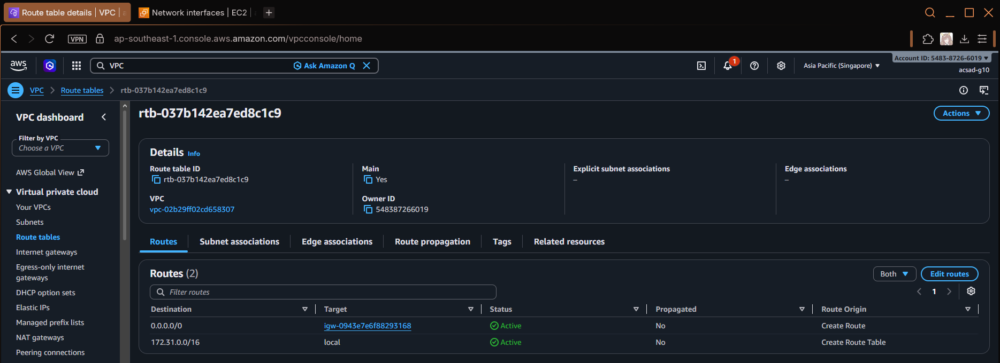
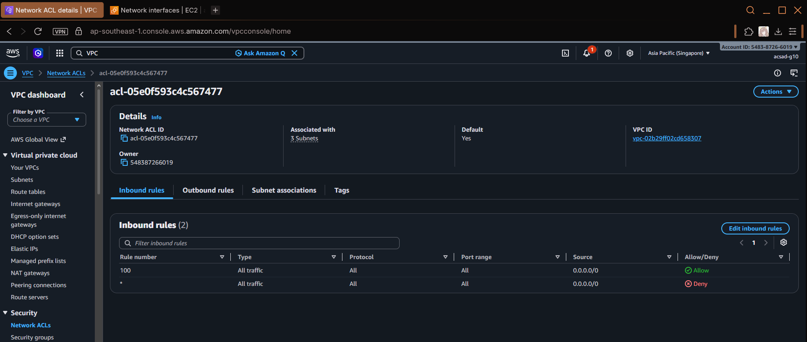
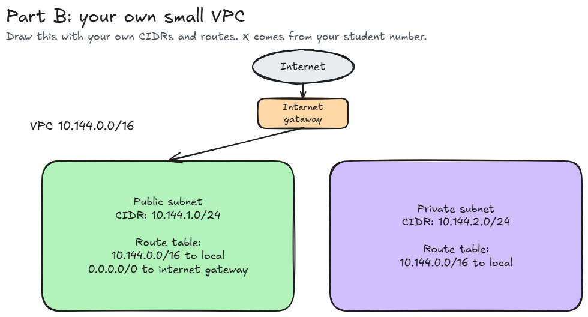

# Assignment 2 Submission

<!--
How to use this template:

1. Copy this file to submissions/assignment-2/<your-github-username>/submission.md
2. Replace every answer placeholder with your own answer. Delete the angle brackets too.
3. Save your four images in the same folder, with the exact file names below.
4. Do not write your full name or your student number in this file.
-->

## About me

- GitHub username: `silicon-dioxide`
- Section: `IV - ACSAD`
- IAM user name that I signed in with: `acsad-g10`
- X: `144`

---

## Part A. Explore

### A1. The VPC

Default VPC IPv4 CIDR:  `172.31.0.0/16`

Number of addresses in that CIDR: `65,536`

### A2. The subnets

| Availability Zone | IPv4 CIDR |
| --- | --- |
| apse1-az2 (ap-southeast-1a) | 172.31.32.0/20 |
| apse1-az1 (ap-southeast-1b) | 172.31.16.0/20 |
| apse1-az1 (ap-southeast-1b) | 172.31.0.0/20 |

`[Screenshot 1: subnet list](screenshot-1-subnets.png)

### A3. Available addresses

Available IPv4 addresses in each subnet:

- subnet-00a120af9f25fdd4d: 4090
- subnet-03a5209dd3590f3f5: 4091
- subnet-09c3dc46f64c311d1: 4091

Why is the number lower than 4,096?

- AWS reserves 5 IP addresses in every VPC subnet for internal networking and infrastructure management.

What uses the missing address in the subnet with the lowest number?

- An active Elastic Network Interface (ENI) attached to a specific resource is using that missing address.

### A4. The route table

| Destination | Target |
| --- | --- |
| 0.0.0.0/0 | igw-0943e7e6f88293168 |
| 172.31.0.0/16 | local |

### A5. Public or private

Are the default subnets public or private? Which route proves it?

- Public, because their associated route table contains a default route (0.0.0.0/0) pointing to an Internet Gateway.

### A6. The internet gateway

State of the internet gateway:
`Attached`

What happens to the default subnets if the gateway is detached?

- If the Internet Gateway is detached from the VPC, all default subnets immediately lose their connection to the public internet and effectively function as private subnets. 

### A7. NAT gateways

Number of NAT gateways: `0`

Can a server in a new private subnet download updates? Why?

- No, a server in the private subnet cannot download updates from the internet.

### A8. The network ACL

| Rule number | Source | Allow or Deny |
| --- | --- | --- |
| 100 | 0.0.0.0/0 | Allow |
| * | 0.0.0.0/0 | Deny |

How is a network ACL different from a security group?

- Network ACL acts as a stateless firewall controlling traffic at the subnet level using ordered allow/deny rules, while a Security Group acts as a stateful firewall controlling traffic at the instance/ENI level using allow-only rules.

### A9. The default security group

Inbound rule (type and source): `All traffic` and `sg-0c5b6d4081cf0a534 / default`

Which resources can send traffic to an instance that uses it?

- Only resources that are assigned to the `sg-0c5b6d4081cf0a534 (default)` security group can send traffic to the instance.

---

## Part B. Prepare

### B1. Plan two subnets

Public subnet CIDR: 10.144.1.0/24
Private subnet CIDR: 10.144.2.0/24

### B2. Route tables

Route table of the public subnet:

| Destination | Target |
| --- | --- |
| 10.144.0.0/16 | local |
| 0.0.0.0/0 | internet gateway |

Route table of the private subnet:

| Destination | Target |
| --- | --- |
| 10.144.0.0/16 | local |

### B3. My VPC diagram

Tool used (Excalidraw, draw.io, Lucidchart, or paper):

<answer>

Save your diagram as `vpc-diagram.png` in your folder. The image line below shows it.

### B4. Predict a change

Can you still open the web page from your laptop? Why?

- No, because removing the internet gateway breaks the path for inbound and outbound traffic between the web server and the public internet.

Can the instance still reach another instance in the VPC? Why?

- Yes, because internal VPC traffic is handled by the local route.

### B5. Place a database

Which subnet gets the database? Why?

- The private subnet, because keeping it isolated without direct public internet access protects sensitive data from unauthorized external access.

### B6. My question about VPCs

What is your question, and what made you think of it?

- If a subnets' available IP addresses run out due to auto-scaling containers or microservices, can we expand the existing subnet CIDR, or do we have to build an entirely new subnet?
